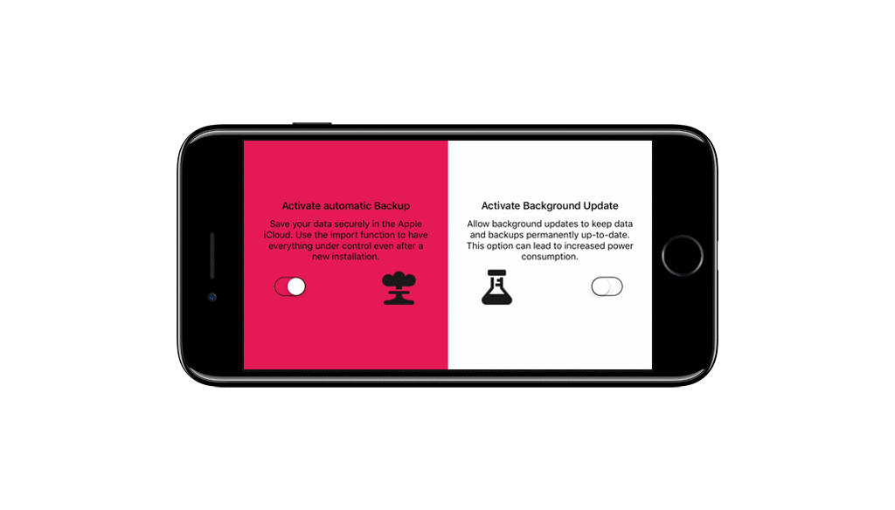

# AnimatedSettingsView

Having seen an animation of this function years ago, I now want to share the AnimatedSettingsView implementation with you. The Views implementations uses a filled `UIBezierPath()` circle, which is animated by its radius. The view itself clips the subviews to it's bounds. The Project is updated with Size Classes, so that rotation is no problem.

## Project

Includes an ExampleProject in Swift 3 which is a SingleViewController-Application with two equal Sized Views. Both Views have two Labels, an ImageView for displaying an icon and an UISwitch Object. The Views are configured by calling `setup(withBackgroundColor color:UIColor)`. Using the delegate function `valueChanged()` of the UISwitch Objects the background is filled.

## Licence

This Project is released under the MIT license. See 'LICENCE.md' for details.
